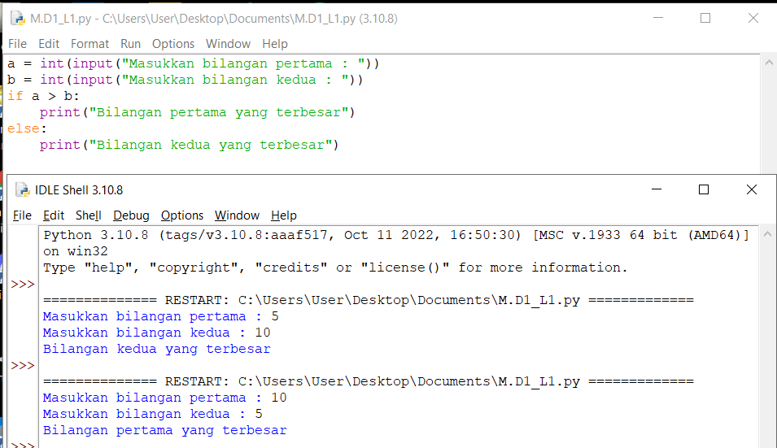
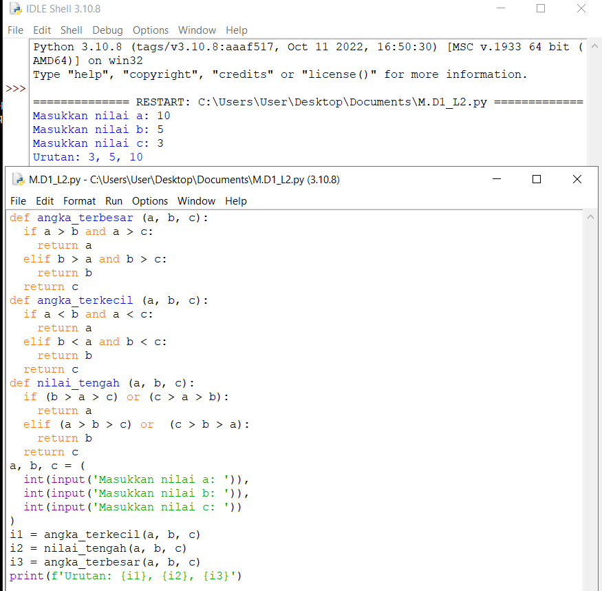
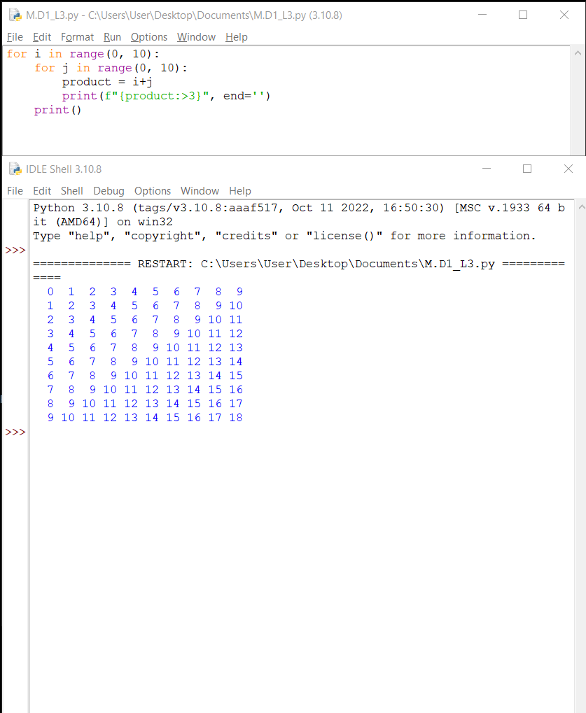

 # praktikum 
## Tugas 1
Buat program sederhada dengan input 2 buah bilangan, kemudian tentukan bilangan terbesar dari kedua bilangan tersebut menggunakan statement if.

## Tugas 2
Buat program untuk mengurutkan data berdasarkan input sejumlah data (minimal 3 variable input atau lebih), kemudian tampilkan hasilnya secara berurutan mulai dari data terkecil.

## Tugas 3
Buat program dengan perulangan bertingkat (nested) for yang menghasilkan output sebagai berikut:

## Tugas 4
Tampilkan n bilangan acak yang lebih kecil dari 0.5.
Nilai n diisi pada saat runtime
Anda bisa menggunakan kombinasi while dan for untuk menyelesaikannya

